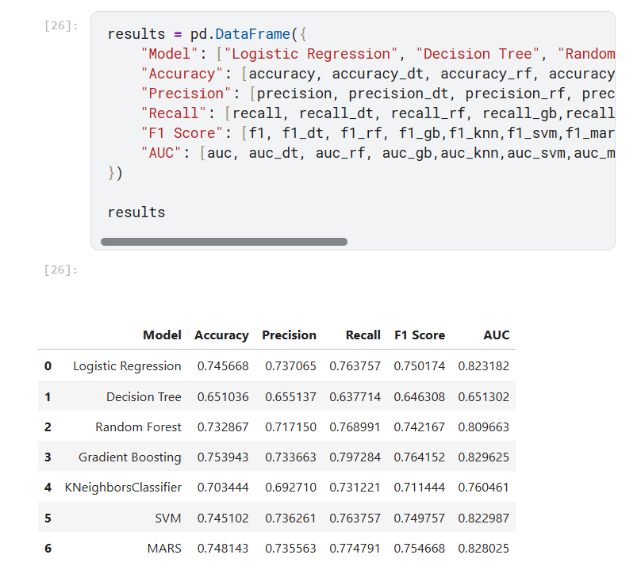
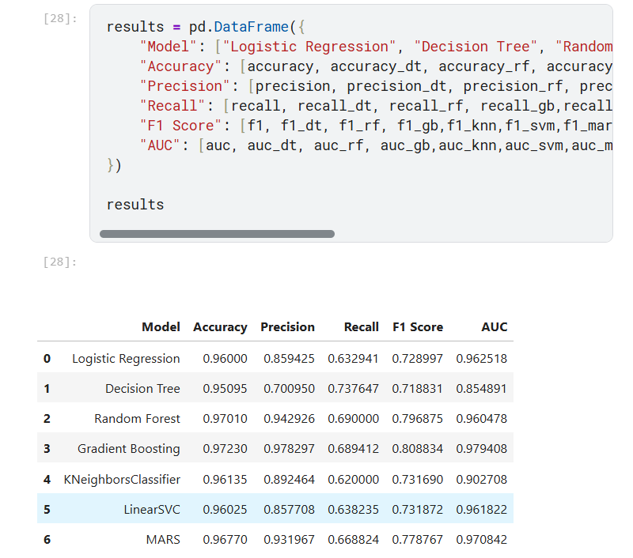
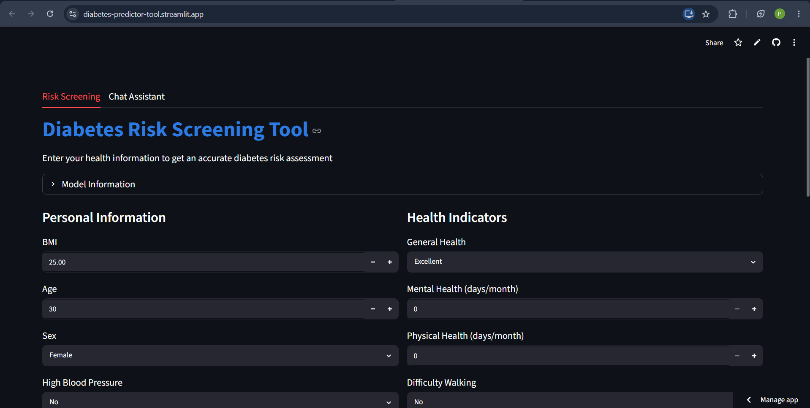
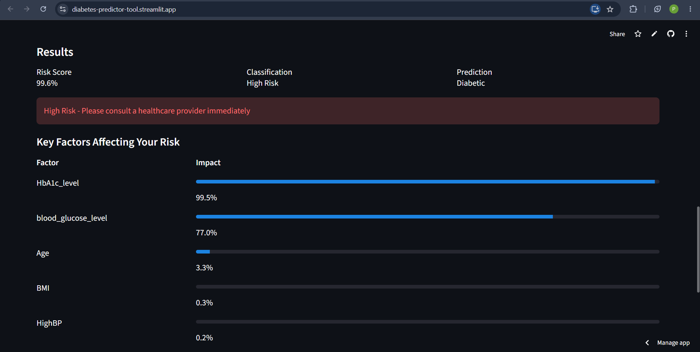
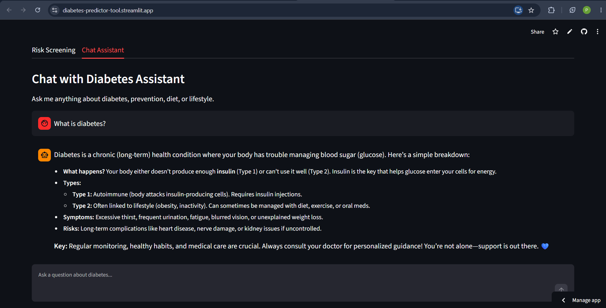

# **Diabetes Prediction System**

A complete web application for diabetes risk screening with an AI-powered chatbot. Predicts diabetes risk based on 22 health indicators using machine learning.

## **Live Demo**
[https://diabetes-predictor-tool.streamlit.app/](https://diabetes-predictor-tool.streamlit.app/)

## **Project Overview**
This project combines two datasets to build a robust diabetes prediction model. The application provides an interactive interface for users to assess their diabetes risk and get personalized recommendations.

## **Datasets Used**

**Real Dataset** (BRFSS 2015)
70,000+ records with health indicators from the Behavioral Risk Factor Surveillance System. Contains features like BMI, HighBP, HighChol, CholCheck, Smoker, Stroke, HeartDiseaseorAttack, PhysActivity, Fruits, Veggies, HvyAlcoholConsump, AnyHealthcare, NoDocbcCost, GenHlth, MentHlth, PhysHlth, DiffWalk, Sex, Age, Education, Income.

**Synthetic Dataset**
100,000+ records generated to supplement the real data. Contains features like gender, age, hypertension, heart_disease, smoking_history, bmi, HbA1c_level, blood_glucose_level.

## **Model Development Process**

**Notebook Analysis**
Both datasets were first analyzed separately in Jupyter notebooks. Exploratory data analysis included correlation heatmaps, feature distributions, and class imbalance analysis. SHAP (SHapley Additive exPlanations) was used for model interpretability to understand which features most influence predictions.

**Preprocessing Steps**
Data cleaning involved handling missing values through median imputation. Features from both datasets were aligned and normalized using MinMaxScaler. The target variable was standardized as binary classification (diabetes or no diabetes).

**Model Training**
Seven different models were trained and evaluated:

- Logistic Regression
- Decision Tree
- Random Forest
- Gradient Boosting
- K-Nearest Neighbors
- Support Vector Machine
- MARS (Multivariate Adaptive Regression Splines)

Each model was evaluated using accuracy, precision, recall, F1-score, and AUC-ROC metrics. SHAP analysis was performed to identify the most important features for each model.

## **Model Accuracy Tables**

| **Real Dataset** | **Synthetic Dataset** |
|:---:|:---:|
|  |  |

## **Combined Dataset Approach**
Both datasets were merged to create a comprehensive dataset with 170,692 records and 22 aligned features. This combined approach leverages the strengths of both real and synthetic data.

## **Final Model Selection**
Three models were retrained on the combined dataset: Random Forest, Hist Gradient Boosting, and Logistic Regression with class balancing. SMOTE oversampling was applied to handle class imbalance. The best performing model (Hist Gradient Boosting) was selected based on AUC score.

## **Application Features**

### **Two Screening Options**
- **Quick Screening:** For users without recent blood test results. Uses lifestyle and demographic factors only (~75% accuracy).
- **Detailed Assessment:** For users with HbA1c and blood glucose values. Uses all clinical features (~97% accuracy).

### **Chat Assistant**
An AI-powered chatbot integrated with Mistral AI provides answers to diabetes-related questions. Users can ask about prevention, symptoms, diet, exercise, and general diabetes information.

### **Feature Importance**
After prediction, users see which factors contributed most to their risk score, helping them understand what lifestyle changes could reduce their risk.

## **Screenshots**

**Screening Page**


**Results Page**


**Chatbot Page**


## **Technical Stack**

**Backend**
Python with scikit-learn for machine learning, pandas for data processing, numpy for numerical operations, joblib for model persistence.

**Frontend**
Streamlit for interactive web interface with custom CSS styling for better readability.

**AI Integration**
Mistral AI API for intelligent chatbot responses.

**Deployment**
Deployed on Streamlit Community Cloud with automatic deployment from GitHub.

## **Machine Learning Pipeline**

**Data Preparation**
The data preparation script aligns features from both datasets, handles missing values through median imputation, and creates separate models for clinical and non-clinical users.

**Model Training**
Features are scaled using MinMaxScaler, class imbalance is addressed with SMOTE, and multiple models are trained with cross-validation. The best model is selected based on AUC score.

**Model Persistence**
The trained models, scalers, and imputers are saved as pickle files for use in the application.

## **Project Files**

**backend/data_preparation.py**
Loads and merges real and synthetic datasets, aligns features to common columns, handles missing values, and trains two models (non-clinical and clinical).

**backend/model_training.py**
Trains Random Forest, Hist Gradient Boosting, and Logistic Regression models with class balancing. Selects the best model based on AUC and saves it along with scaler and imputer.

**frontend/app.py**
Main Streamlit application with two screening tabs, results display with feature importance, and chatbot integration.

**frontend/chatbot.py**
Handles Mistral AI integration for the chat assistant with quick question suggestions.

**frontend/requirements.txt**
Lists all Python dependencies including streamlit, pandas, numpy, scikit-learn, joblib, requests, and python-dotenv.

## **Deployment**
The application is deployed on Streamlit Community Cloud and automatically updates when changes are pushed to the GitHub repository.

## **Installation**

```bash
# Clone the repository
git clone https://github.com/varnika-14/Diabetes-Prediction-System.git
cd Diabetes-Prediction-System

# Install dependencies
pip install -r frontend/requirements.txt

# Generate models
cd backend
python data_preparation.py
cd ..

# Run the app
streamlit run frontend/app.py
